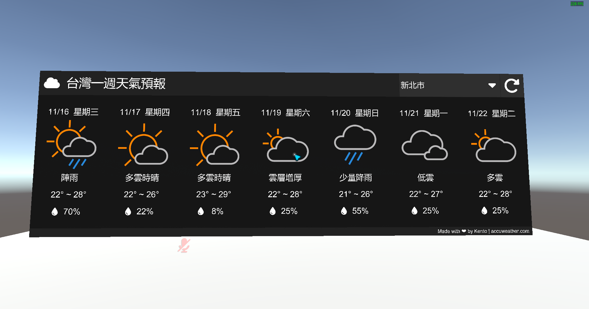
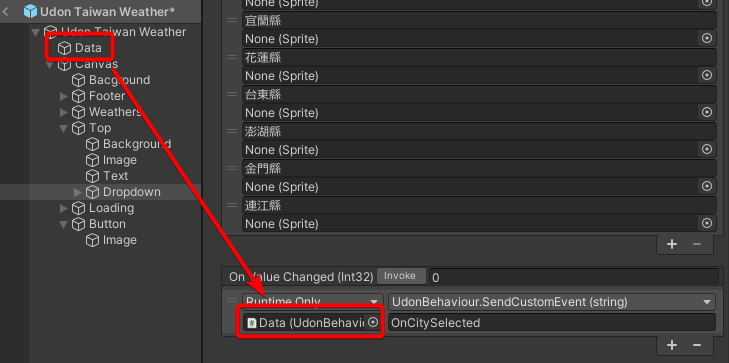

# VRChat 台灣一週天氣預報
在 VRChat 顯示台灣各縣市未來一週天氣預報，資料來源為 [accuweather.com](https://www.accuweather.com/)  
目前資料每兩個小時更新一次  

  

## 範例世界
- [VRChat 連結](https://vrchat.com/home/world/wrld_bf81266b-feb3-4d3b-8cc8-c2525be7d115)
## Unity 使用方法
- 安裝 VRChat World SDK3
- 安裝 UdonSharp
- 至 [Releases](https://github.com/rogeraabbccdd/Udon-TaiwanWeather/releases) 下載 unitypackage 後匯入至專案
- UdonSharp 0.x 需手動修改 prefab 設定
  - 開啟 `Udon Taiwan Weather.prefab`
  - 至 `Udon Taiwan Weather/Data`，找到 `Weather Video (Script)` 元件，點 `Convert To UdonBehaviour`
  - 移除 `Udon Taiwan Weather/Data` 重複的、沒有預設設定值的 `UdonBehaviour` 元件
  - 找到 `Udon Taiwan Weather/Canvas/Button` 的 `Button` 元件，將 `Udon Taiwan Weather/Data` 拖曳至 `On Click ()` 內，選擇 `Runtime Only`、`UdonBehaviour.SendCustomEvent(string)`，輸入 `Reload`  
    
  - 找到 `Udon Taiwan Weather/Canvas/Top/Dropdown` 的 `Dropdown` 元件，將 `Udon Taiwan Weather/Data` 拖曳至 `On Value Changed (Int32)` 內，選擇 `Runtime Only`、`UdonBehaviour.SendCustomEvent(string)`，並輸入 `OnCitySelected`  
    
- 將 `Udon Taiwan Weather.prefab` 放入場景
- 至 `Udon Taiwan Weather/Data` 設定預設縣市，能使用的值有
  - 基隆市
  - 台北市
  - 新北市
  - 桃園市
  - 新竹市
  - 新竹縣
  - 苗栗縣
  - 台中市
  - 彰化縣
  - 南投縣
  - 雲林縣
  - 嘉義市
  - 嘉義縣
  - 台南市
  - 高雄市
  - 屏東縣
  - 宜蘭縣
  - 花蓮縣
  - 台東縣
  - 澎湖縣
  - 金門縣
  - 連江縣

## 資料來源
- 圖示來源為 [accuweather.com](https://www.accuweather.com/) 及 [Font Awesome](https://fontawesome.com/)  
